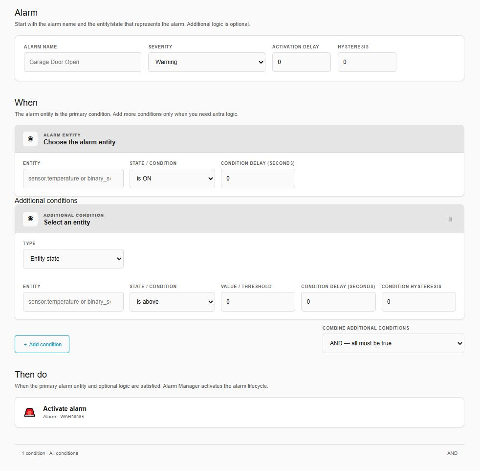
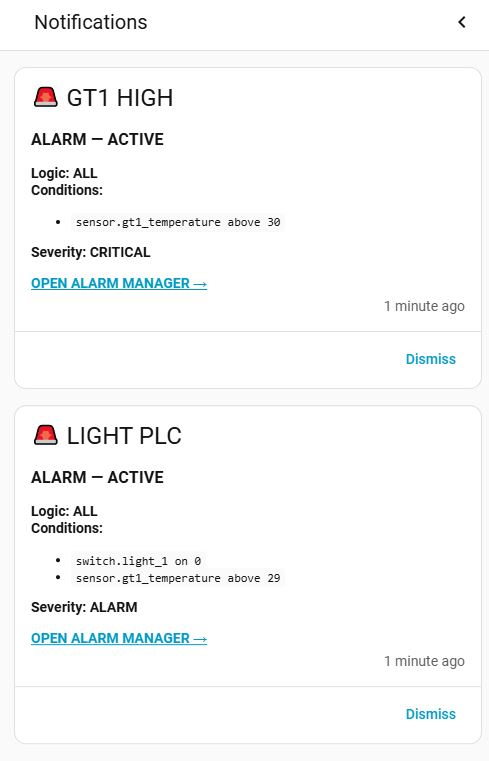

# 🚨 Alarm Manager

**Industrial-style alarm management for Home Assistant.**

Alarm Manager adds a dedicated alarm layer to Home Assistant for users who want a workflow closer to **PLC / SCADA alarm management**: severity, acknowledgement, lifecycle, history, operator tracking, notifications and configurable alarm conditions.


[](https://buymeacoffee.com/polynordengineering)

Turn ordinary Home Assistant entities into managed alarms with lifecycle, acknowledgement, delay, hysteresis and history.

## ✨ What is new in v0.2.0

**v0.2.0 is the current official GitHub release of Alarm Manager.** It introduces the expanded alarm model and a new visual workflow for creating and managing alarms.

- 🧩 **Automation-style alarm editor** — create and edit alarms from the Alarm Manager sidebar.
- 🎯 **Primary alarm entity** — define the main entity and its state/threshold first, then add optional conditions.
- 🔗 **Multiple conditions** — combine conditions with **ALL / AND** or **ANY / OR** logic.
- 🕐 **Time conditions** — after, before and between time windows, including overnight ranges.
- ⏱️ **Per-condition delay** — require an individual condition to remain true for a configured period.
- ↔️ **Per-condition hysteresis** — reduce chatter around individual numeric limits.
- 🚨 **Conditionless/manual alarms** — create alarms without automatic conditions and trigger them from automations, scripts or PLC workflows.
- 🔔 **Dedicated Notifications page** — manage notification services and targets from the Alarm Manager sidebar.
- 👥 **Notification targets and severity routing** — route Info, Warning, Alarm and Critical notifications to different targets.
- 📱 **Mobile-friendly UI** — safe-area handling and mobile navigation support.
- 🗂️ **History severity filtering** — filter completed alarm occurrences by severity.
- 👤 **Acknowledgement tracking** — record the Home Assistant user who acknowledged an alarm.
- 🔄 **Improved condition reconciliation** — stale active occurrences can clear correctly when their conditions return to normal.

> **HACS status:** The HACS submission was prepared against the earlier v0.1.7 release. v0.2.0 is now the current official GitHub release. HACS availability and GitHub release availability are separate.

---

## Why Alarm Manager?

Home Assistant is excellent at automation. Alarm Manager adds a dedicated layer for situations where an event should be treated as an **alarm**, rather than just another entity state.

Typical use cases include:

- PLC and industrial automation
- HVAC and building automation
- Energy monitoring
- Pumps, fans and motors
- Temperature and process limits
- Home security and equipment alarms
- Modbus / MQTT / ESPHome / Shelly based systems

The integration is local and works with entities already available in Home Assistant.

---

## 🖥️ Alarm Manager interface

v0.2.0 introduces a dedicated Alarm Manager experience for day-to-day alarm operation.

From the Alarm Manager interface you can:

- View current alarms
- Add alarms
- Edit alarms
- Delete alarms
- Acknowledge alarms
- Review alarm history
- Filter history by severity
- Manage notification targets

The Home Assistant integration configuration remains available for integration-level management, but normal alarm operation no longer requires repeatedly navigating through **Settings → Devices & services**.


*Alarm Manager showing active alarms, notification targets and alarm history.*

---

## 🧩 Add an alarm

The v0.2.0 editor is designed around a simple **Alarm → When → Then do** workflow.

### Alarm

Start with the alarm name, severity, activation delay and hysteresis.


The basic editor lets you define the alarm without navigating through multiple configuration pages.

---

## 🎯 Primary alarm entity

The alarm entity is the **primary condition** of the alarm.

For example:

```text
Alarm name:       Garage Door Open
Severity:         Warning
Entity:           binary_sensor.garage_door
State / condition: is ON
```

For a numeric alarm:

```text
Alarm name:       GT1 High Temperature
Severity:         Alarm
Entity:           sensor.gt1_temperature
State / condition: is above
Value / threshold: 29 °C
```

The editor makes the primary entity explicit: **additional logic is optional**.

---

## 🔗 Additional conditions

When a simple primary condition is not enough, use **Add condition** to add more logic.



Additional conditions can be combined using:

- **AND — all must be true**
- **OR — any can be true**

Example:

```text
Garage Door = ON
        AND
Outside Temperature < 15 °C
        AND
Time is after 21:00
```

Or:

```text
Pump A = OFF
        OR
Pump B = OFF
        OR
Motor Fault = ON
```

### Supported entity conditions

- Above
- Below
- Equal
- Not equal
- On
- Off
- Unavailable
- Unknown

### Supported time conditions

- After
- Before
- Between

Overnight ranges such as `21:00 → 06:00` are supported.

---

## ⏱️ Activation delay and hysteresis

Alarm Manager supports filtering conditions before an alarm becomes active.

### Activation delay

A condition can require a value to remain true for a configured period.

Example:

```text
GT1 Temperature > 29 °C
Condition delay: 30 seconds
```

The condition must remain true for 30 seconds before it becomes active.

### Hysteresis

Numeric conditions can use hysteresis to reduce chatter around a limit.

Example:

```text
Above: 29 °C
Hysteresis: 2 °C
```

The configured hysteresis is applied when determining when the condition returns to normal.

---

## 🚨 Manual / conditionless alarms

Not every alarm needs an entity condition.

You can create a conditionless alarm and trigger it externally from another Home Assistant workflow, automation, script or PLC integration.

For example:

```yaml
action: alarm_manager.trigger_alarm
data:
  alarm_id: plc_emergency_stop
```

This is useful when another system already contains the logic that determines when an alarm should occur.

---

## 🔄 Alarm lifecycle

Alarm Manager treats an alarm occurrence as a lifecycle:

```text
NORMAL
  │
  │ condition becomes true
  ▼
ACTIVE
  │
  ├── ACKNOWLEDGED
  │
  │ condition clears
  ▼
CLEARED
  │
  ▼
HISTORY
```

Acknowledgement does **not** clear the underlying alarm. It records that an operator has seen the alarm.

The alarm clears when its conditions are no longer satisfied, taking configured hysteresis into account.

---

## 🚦 Severity levels

Alarm Manager supports four severity levels:

| Severity | Typical use |
|---|---|
| 🔵 **Info** | Information or operator notification |
| 🟡 **Warning** | Condition requiring attention |
| 🟠 **Alarm** | Abnormal condition requiring action |
| 🔴 **Critical** | High-priority condition requiring immediate attention |

The exact operational meaning is defined by your installation's alarm philosophy.

---

## 🔔 Notifications

v0.2.0 introduces dedicated notification target management.

### Notification targets

A target can be a Home Assistant mobile app, phone, tablet or another Home Assistant notification service.


For example:

```text
Target:       Kristofer
Notify service: mobile_app_kristofer
```

### Severity routing

Each target can be configured for the severities it should receive:

- Critical
- Alarm
- Warning
- Info

This allows different operators or devices to receive different alarm levels.

---

## 📱 Home Assistant notifications

Alarm Manager notifications can appear directly in Home Assistant.



Notifications include the alarm name, current state, logic and conditions, severity and a direct link back to Alarm Manager.

This gives the operator a quick path from:

**Notification → Alarm Manager → Acknowledge / investigate**

---

## 👤 Acknowledgement and users

Alarm Manager records the Home Assistant user associated with acknowledgements when that information is available.

Current alarms and history can show:

- Acknowledgement state
- Acknowledgement time
- Acknowledged by

Acknowledgement records that an operator has seen the alarm; it does not by itself clear the alarm.

---

## 🗂️ Alarm history

Completed alarm occurrences remain available in history.

History can include:

- Alarm name
- Severity
- Trigger value
- Limit / condition
- Activation time
- Clear time
- Duration
- Acknowledgement
- Acknowledgement time
- Acknowledging user

History can be filtered by severity.

There is currently **no automatic history retention limit**. History remains stored until it is cleared from Alarm Manager.

---

## 📱 Mobile support

The Alarm Manager frontend includes mobile-specific handling for Home Assistant's safe-area insets and sidebar navigation.

On supported mobile layouts:

- The Home Assistant sidebar can be opened from Alarm Manager.
- Editor controls respect phone safe areas.
- Add/Edit screens keep their Back and Save controls accessible.
- Alarm notifications can link directly back to Alarm Manager.

---

## ⚙️ Home Assistant integration settings

Alarm Manager is also visible under Home Assistant's integration settings.

For the official v0.2.0 release, the integration version is:

```text
0.2.0
```

If Home Assistant still shows a version such as `0.2.0-beta.17`, it is running an older beta installation. Remove/update that installation and restart Home Assistant so the released `0.2.0` manifest is loaded.

The official v0.2.0 repository manifest contains:

```json
"version": "0.2.0"
```

---

## 📦 Installation

### HACS

Alarm Manager is available from this GitHub repository. HACS review/default-list status is separate from the GitHub release itself.

If the repository is not yet in the HACS default list, it can be added as a custom repository:

1. Open **HACS**.
2. Go to **Integrations**.
3. Open the menu in the top-right.
4. Select **Custom repositories**.
5. Add:

```text
https://github.com/PolynordEngineering/alarm-manager
```

6. Select **Integration**.
7. Install Alarm Manager.
8. Restart Home Assistant.

Then open the **Alarm Manager** sidebar panel.

### Manual installation

Copy:

```text
custom_components/alarm_manager/
```

to:

```text
/config/custom_components/alarm_manager/
```

Restart Home Assistant.

---

## 🛠️ Services

Alarm Manager exposes services for integration with Home Assistant automations and external logic.

Important services include:

```text
alarm_manager.create_alarm
alarm_manager.update_alarm
alarm_manager.trigger_alarm
alarm_manager.acknowledge_alarm
alarm_manager.acknowledge_all
alarm_manager.remove_alarm
alarm_manager.clear_history
alarm_manager.set_default_notification
alarm_manager.set_notification_targets
```

The visual Alarm Manager editor is the recommended way to configure alarms. Services are useful when another automation or integration needs to create, update, trigger or acknowledge an alarm.

See `custom_components/alarm_manager/services.yaml` for the current service schema.

---

## 📸 Screenshots

### Alarm Manager


### Add Alarm


### Add Alarm with additional conditions


### Notification Target


### Home Assistant Notifications


Additional UI captures are kept in [`docs/images/`](docs/images/).

---

## 🗺️ Roadmap

Possible future areas include:

- More condition types
- More advanced alarm grouping
- Improved alarm shelving/inhibit workflows
- Expanded operator workflows
- More notification channels
- Additional SCADA-style features
- Automated test coverage for the alarm engine and frontend
- Configurable history retention

Suggestions and practical use cases are welcome.

## ☕ Support the Project

Alarm Manager is open source and free to use.

If you find it useful and would like to support continued development, testing and new features, you can buy me a coffee:

[☕ Support Polynord Engineering](https://buymeacoffee.com/polynordengineering)

Thank you for supporting the project!

---

## 📄 License

Alarm Manager v0.2.0 and later are licensed under the **PolyForm Noncommercial License 1.0.0**.

You may use, inspect, modify, and distribute the software for permitted **noncommercial** purposes, subject to the license terms.

**Commercial use, commercial deployment, resale, commercial redistribution, bundling into a commercial product or service, or use as part of a paid customer solution requires a separate written commercial license from Polynord Engineering.**

See [`LICENSE`](LICENSE) for the complete license terms and [`COMMERCIAL-LICENSE.md`](COMMERCIAL-LICENSE.md) for commercial licensing information.

> **License note:** Alarm Manager is source-available software and is **not an OSI Open Source licensed project**.

## 🤝 Contributing

Found a bug or have an idea?

Open an issue:

https://github.com/PolynordEngineering/alarm-manager/issues

Pull requests and practical feedback are welcome, especially from users integrating Home Assistant with PLCs, Modbus, SCADA or industrial automation systems.

---

## About

**Alarm Manager** is developed by **Polynord Engineering**.

Built with Home Assistant for people who want more than a simple notification when something goes wrong.

⭐ If you find the project useful, consider starring the repository and sharing your feedback.
