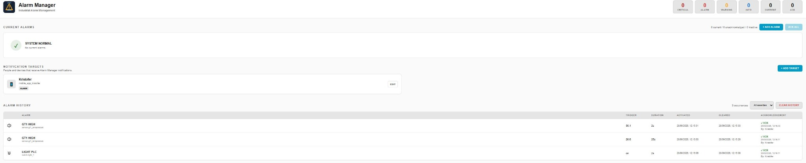

# 🚨 Alarm Manager

**Industrial-style alarm management for Home Assistant.**

Alarm Manager adds a dedicated alarm layer to Home Assistant for users who want a workflow closer to **PLC / SCADA alarm management**: severity, acknowledgement, lifecycle, history, operator tracking, notifications and configurable alarm conditions.


## ✨ What is new in v0.2.0

Version **0.2.0** is a major UI and alarm-engine update focused on making Alarm Manager easier to configure while adding more advanced alarm logic.

- 🧩 **Automation-style alarm editor** — create and edit alarms from the Alarm Manager sidebar without navigating through Home Assistant Integrations.
- 🎯 **Primary alarm entity** — define the entity and its state/threshold first, then add optional additional conditions.
- 🔗 **Multiple conditions** — combine conditions with **ALL / AND** or **ANY / OR** logic.
- 🕐 **Time conditions** — after, before and between time windows, including overnight ranges.
- ⏱️ **Per-condition delay** — require an individual condition to remain true for a configured period.
- ↔️ **Per-condition hysteresis** — reduce chatter around individual numeric limits.
- 🚨 **Conditionless/manual alarms** — create alarms without automatic conditions and trigger them from automations, scripts or PLC workflows.
- 🔔 **Dedicated Notifications page** — manage notification services and targets from the Alarm Manager sidebar.
- 👥 **Notification targets and severity routing** — route Info, Warning, Alarm and Critical notifications to different targets.
- 📱 **Mobile-friendly UI** — safe-area handling and mobile navigation support.
- 🗂️ **History severity filtering** — filter completed alarm occurrences by severity.
- 👤 **Acknowledgement tracking** — record the Home Assistant user who acknowledged an alarm.
- 🔄 **Improved condition reconciliation** — alarm state is re-evaluated so stale active occurrences can clear correctly.

> **v0.2.0 is a development release candidate for the new alarm model.** Test it in your environment before deploying it to production systems.

---

## Why Alarm Manager?

Home Assistant is excellent at automation. Alarm Manager adds a dedicated layer for situations where an event should be treated as an **alarm**, rather than just another entity state.

Typical use cases include:

- PLC and industrial automation
- HVAC and building automation
- Energy monitoring
- Pumps, fans and motors
- Temperature and process limits
- Home security and equipment alarms
- Modbus / MQTT / ESPHome / Shelly based systems

The integration is local and works with entities already available in Home Assistant.

---

## 🖥️ One place to manage alarms

Alarm Manager v0.2.0 moves day-to-day alarm configuration into its own Home Assistant sidebar experience.

### Alarm Manager

Use the **Alarm Manager** sidebar entry to:

- View current alarms
- Add alarms
- Edit alarms
- Delete alarms
- Acknowledge alarms
- Review history
- Filter history by severity

### Notifications

Use the dedicated **Notifications** sidebar entry to:

- Configure the default notification service
- Add notification targets
- Edit notification targets
- Delete notification targets
- Configure severity routing

The Home Assistant integration configuration remains available for integration-level management, but normal alarm operation no longer requires repeatedly navigating through **Settings → Devices & services**.


*Alarm Manager v0.2.0: current alarms, notification targets and history in one place.*

---

## 🧩 Automation-style alarm editor

The alarm editor is designed around a simple flow:

```text
ALARM
  │
  ├── Name
  ├── Primary entity
  ├── Severity
  ├── Activation delay
  └── Hysteresis

WHEN
  │
  ├── Primary entity condition
  │
  ├── AND / OR
  ├── Additional condition
  ├── AND / OR
  └── Additional condition

THEN
  │
  └── Alarm becomes active
```

A simple alarm can contain only a primary entity condition.

A more advanced alarm can add additional conditions.

A manual alarm can have **no automatic conditions at all** and can be triggered through the `alarm_manager.trigger_alarm` service.


*Automation-style alarm editor with a primary alarm entity and optional additional logic.*

---

## 🎯 Primary alarm entity

The first condition defines the main alarm entity.

For a binary alarm:

```text
Name:       Garage Door Open
Entity:     binary_sensor.garage_door
Condition:  is ON
Severity:   Warning
```

For a numeric alarm:

```text
Name:       GT1 High Temperature
Entity:     sensor.gt1_temperature
Condition:  is above
Limit:      29 °C
Severity:   Alarm
```

The Alarm Manager panel displays the current value and configured limit so the operator can immediately see why an alarm is active.

---

## 🔗 Multiple conditions

Additional conditions can be added when a simple entity condition is not enough.

Example:

```text
Garage Door = ON
        AND
Outside Temperature < 15 °C
        AND
Time is after 21:00
```

Or use **ANY / OR**:

```text
Pump A = OFF
        OR
Pump B = OFF
        OR
Motor Fault = ON
```

Each condition is configured independently.

### Supported entity conditions

- Above
- Below
- Equal
- Not equal
- On
- Off
- Unavailable
- Unknown

### Supported time conditions

- After
- Before
- Between

Overnight time ranges such as `21:00 → 06:00` are supported.

---

## ⏱️ Condition delay and hysteresis

v0.2.0 supports delay and hysteresis at both alarm and condition level.

### Condition delay

A condition can require a value to remain true before that condition becomes active.

Example:

```text
GT1 Temperature > 29 °C
Condition delay: 30 seconds
```

The temperature must remain above 29 °C for 30 seconds before the condition becomes true.

### Condition hysteresis

Numeric conditions can also have their own hysteresis.

Example:

```text
Above: 29 °C
Hysteresis: 2 °C
```

The alarm condition does not immediately chatter around the 29 °C boundary. The clear threshold is offset by the configured hysteresis.

### Alarm-level delay and hysteresis

The overall alarm also retains its activation delay and hysteresis settings for installations that need an additional layer of filtering.

---

## 🚨 Manual / conditionless alarms

Not every alarm needs to be driven directly by an entity condition.

You can create an alarm without automatic conditions and trigger it from another Home Assistant workflow:

```yaml
action: alarm_manager.trigger_alarm
data:
  alarm_id: plc_emergency_stop
```

This is useful when a PLC, automation or integration already contains the logic that determines when an alarm should occur.

---

## 🔄 Alarm lifecycle

Alarm Manager treats each alarm occurrence as a lifecycle:

```text
NORMAL
  │
  │ condition becomes true
  ▼
ACTIVE
  │
  ├── ACKNOWLEDGED
  │
  │ condition clears
  ▼
CLEARED
  │
  ▼
HISTORY
```

Acknowledgement does **not** clear the underlying alarm. It records that an operator has seen the alarm.

The alarm clears when its conditions are no longer satisfied, taking configured hysteresis into account.

---

## 🚦 Severity levels

Alarm Manager supports four severity levels:

| Severity | Typical use |
|---|---|
| 🔵 **Info** | Information or operator notification |
| 🟡 **Warning** | Condition requiring attention |
| 🟠 **Alarm** | Abnormal condition requiring action |
| 🔴 **Critical** | High-priority condition requiring immediate attention |

The exact operational meaning is defined by your installation's alarm philosophy.

---

## 🔔 Notifications

Alarm Manager supports persistent Home Assistant notifications and mobile notification services.

### Notification targets

Create named targets such as:

```text
Operator
Maintenance
Duty Engineer
Mobile
```

Each target can use its own Home Assistant `notify` service.


*Notification target editor with Home Assistant notify service and severity routing.*

### Severity routing

Different targets can receive different severities:

```text
INFO      → Operator
WARNING   → Operator + Maintenance
ALARM     → Operator + Maintenance
CRITICAL  → Operator + Duty Engineer
```

Routing is configured from the Alarm Manager **Notifications** page.

### Direct links

Notifications can contain a direct link back to the Alarm Manager panel so the operator can immediately inspect and acknowledge the alarm.

---

## 👤 Acknowledgement and users

Alarm Manager records the Home Assistant user associated with acknowledgements when that information is available.

Current alarms and history can show:

- Acknowledgement state
- Acknowledgement time
- Acknowledged by

Notification targets are separate from Home Assistant user accounts. Alarm Manager uses notification targets to determine **where** alarms are delivered.

---

## 🗂️ Alarm history

Completed alarm occurrences remain available in history.

History can include:

- Alarm name
- Severity
- Trigger value
- Limit / condition
- Activation time
- Clear time
- Duration
- Acknowledgement
- Acknowledgement time
- Acknowledging user

### Severity filter

The history view can be filtered by:

- All severities
- Critical
- Alarm
- Warning
- Info

The filter only affects the history list and does not change current alarms.

There is currently **no automatic history retention limit**. History remains stored until it is cleared from Alarm Manager.

---

## 📱 Mobile support

The Alarm Manager frontend includes mobile-specific handling for Home Assistant's safe-area insets and sidebar navigation.

On supported mobile layouts:

- The Home Assistant sidebar can be opened from Alarm Manager.
- Editor controls respect the phone status/navigation areas.
- Add/Edit screens keep their Back and Save controls accessible.

---

## 📦 Installation

### HACS

Alarm Manager is intended for installation through HACS.

While the repository is awaiting/default-list review, it can be added as a custom repository:

1. Open **HACS**.
2. Go to **Integrations**.
3. Open the menu in the top-right.
4. Select **Custom repositories**.
5. Add:

```text
https://github.com/PolynordEngineering/alarm-manager
```

6. Select **Integration**.
7. Install **Alarm Manager**.
8. Restart Home Assistant.

Then open the **Alarm Manager** sidebar panel.

> HACS default-list inclusion and the integration release are separate steps. Follow the repository/release status for the version you intend to install.

### Manual installation

Copy:

```text
custom_components/alarm_manager/
```

to:

```text
/config/custom_components/alarm_manager/
```

Restart Home Assistant.

---

## 🛠️ Services

Alarm Manager exposes services for integration with Home Assistant automations and external logic.

Important services include:

```text
alarm_manager.create_alarm
alarm_manager.update_alarm
alarm_manager.trigger_alarm
alarm_manager.acknowledge_alarm
alarm_manager.acknowledge_all
alarm_manager.remove_alarm
alarm_manager.clear_history
alarm_manager.set_default_notification
alarm_manager.set_notification_targets
```

The visual Alarm Manager editor is the recommended way to configure alarms. Services are useful when another automation or integration needs to create, update, trigger or acknowledge an alarm.

See `custom_components/alarm_manager/services.yaml` for the current service schema.

---

## 📸 Screenshots

### Alarm Manager


### Add / Edit Alarm


### Notification Target


### Alarm History



Additional UI captures, including severity routing and mobile notifications, are kept in [`docs/images/`](docs/images/).

---

## 🧪 v0.2.0 testing status

v0.2.0 has been developed through a series of beta builds covering the new editor, multi-condition alarms, notifications, mobile UI, history filtering and alarm-state reconciliation.

Before calling the release production-ready, test at minimum:

- Creating a binary alarm
- Creating a numeric alarm
- Editing an existing alarm
- Adding/removing additional conditions
- ALL / ANY logic
- Condition delay
- Condition hysteresis
- Alarm delay/hysteresis
- Conditionless/manual alarms
- Alarm acknowledgement and clearing
- Notification targets
- Severity routing
- History filtering
- Desktop UI
- Home Assistant mobile UI
- Home Assistant restart and persistence

---

## 🗺️ Roadmap

Possible future areas include:

- More condition types
- More advanced alarm grouping
- Improved alarm shelving/inhibit workflows
- Expanded operator workflows
- More notification channels
- Additional SCADA-style features
- Automated test coverage for the alarm engine and frontend
- Configurable history retention

Suggestions and practical use cases are welcome.

---

## 📄 License

Alarm Manager v0.2.0 and later are licensed under the **PolyForm Noncommercial License 1.0.0**.

You may use, inspect, modify, and distribute the software for permitted **noncommercial** purposes, subject to the license terms.

**Commercial use, commercial deployment, resale, commercial redistribution, bundling into a commercial product or service, or use as part of a paid customer solution requires a separate written commercial license from Polynord Engineering.**

See [`LICENSE`](LICENSE) for the complete license terms and [`COMMERCIAL-LICENSE.md`](COMMERCIAL-LICENSE.md) for commercial licensing information.

> **License note:** Alarm Manager is source-available software and is **not an OSI Open Source licensed project**.

## 🤝 Contributing

Found a bug or have an idea?

Open an issue:

https://github.com/PolynordEngineering/alarm-manager/issues

Pull requests and practical feedback are welcome, especially from users integrating Home Assistant with PLCs, Modbus, SCADA or industrial automation systems.

---

## About

**Alarm Manager** is developed by **Polynord Engineering**.

Built with Home Assistant for people who want more than a simple notification when something goes wrong.

⭐ If you find the project useful, consider starring the repository and sharing your feedback.
