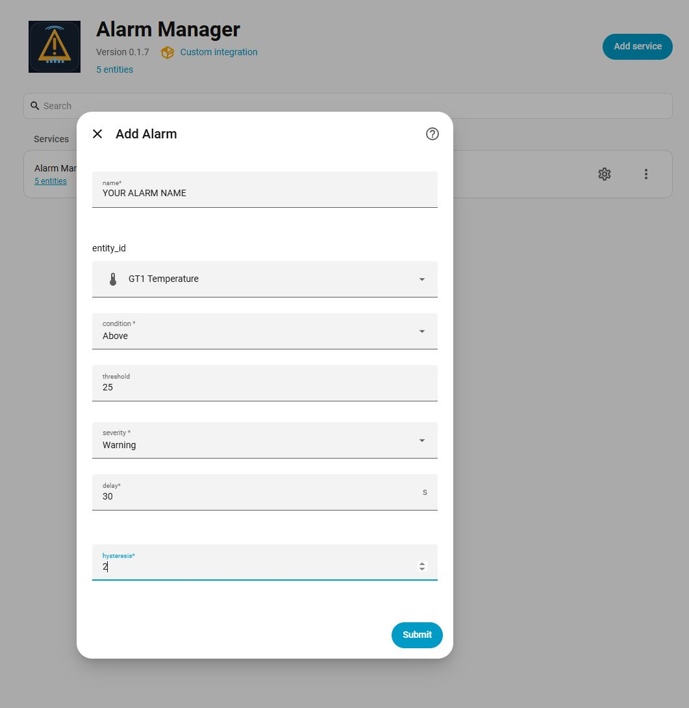
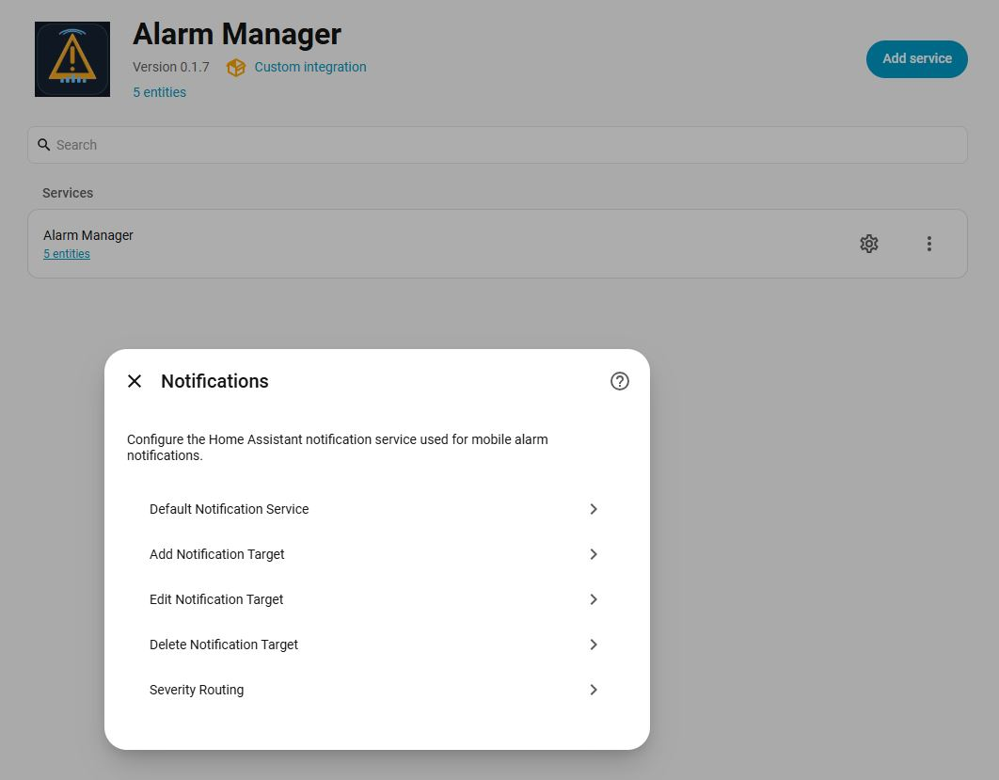
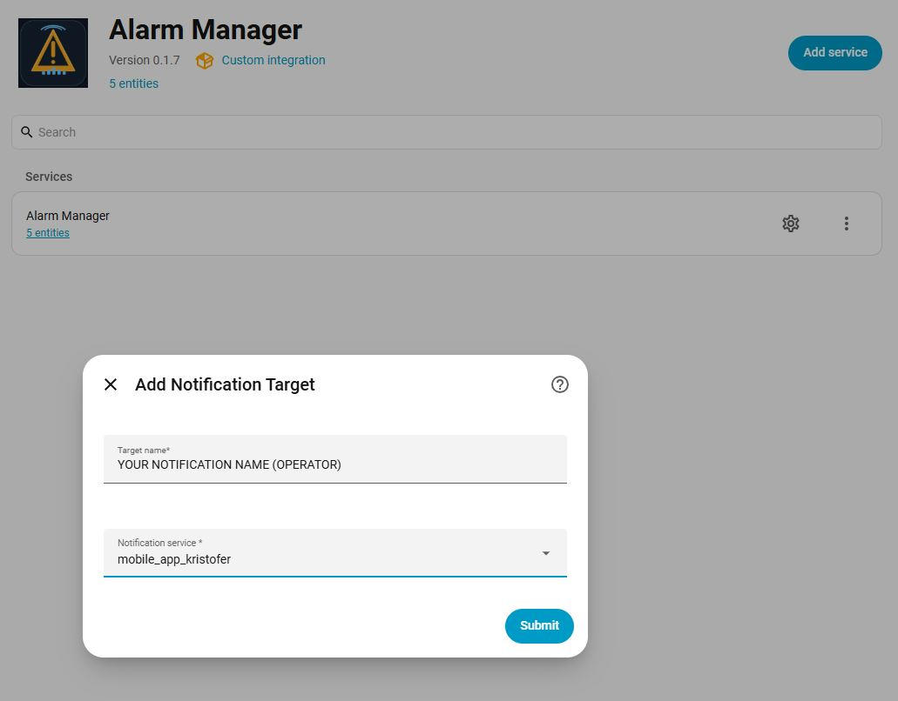
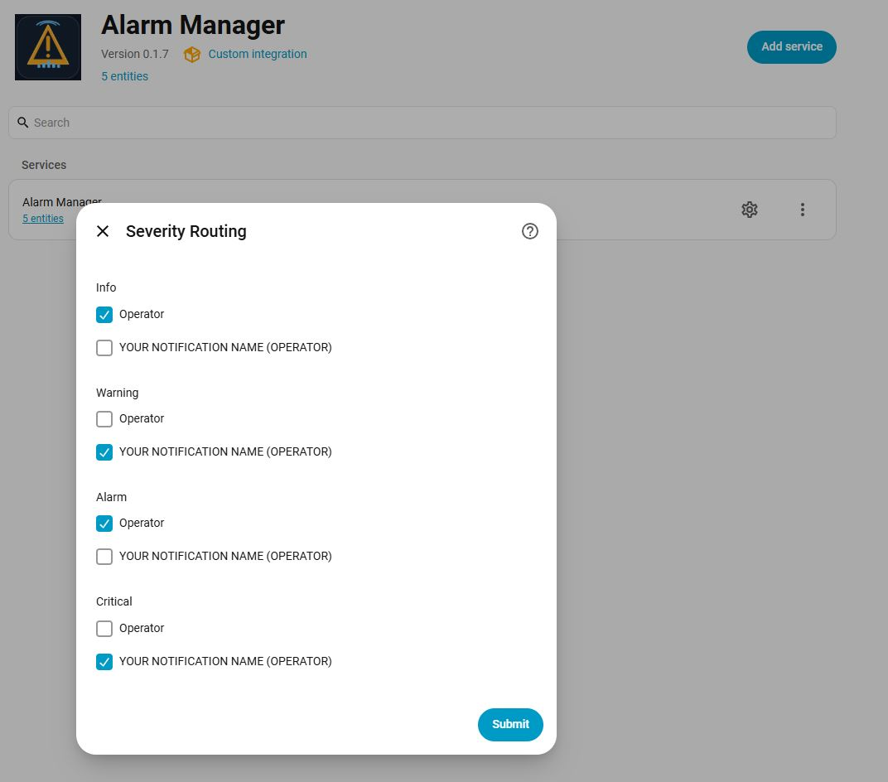
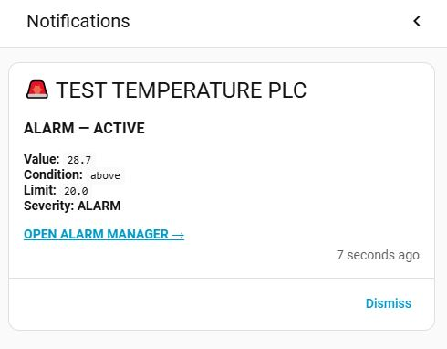
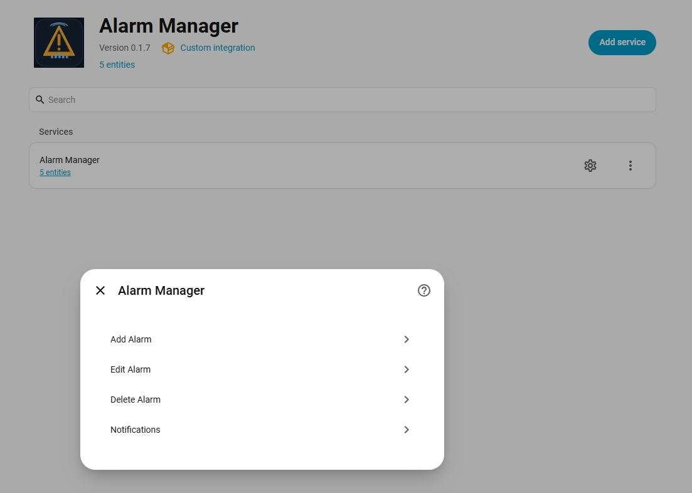

# 🚨 Alarm Manager

**Industrial-style alarm management for Home Assistant.**

Turn ordinary Home Assistant entities into a proper alarm system with **severity levels, acknowledgement, alarm history, activation delays, hysteresis and persistent notifications**.

> Built for Home Assistant users who want an alarm workflow closer to the way alarms are handled in PLC/SCADA systems.


## Why Alarm Manager?

Home Assistant is excellent at automation. Alarm Manager adds a dedicated layer for situations where an event should be treated as an **alarm**, not just another sensor state.

### Key features

| Feature | What it does |
|---|---|
| 🚦 **4 severity levels** | Info, Warning, Alarm and Critical |
| 🔔 **Alarm lifecycle** | Active → Acknowledged → Cleared → History |
| 👤 **Acknowledgement tracking** | Records who acknowledged an alarm |
| 🗂️ **Alarm history** | Keeps completed alarm occurrences and durations |
| ⏱️ **Activation delay** | Avoid nuisance alarms from short-lived conditions |
| ↔️ **Hysteresis** | Prevents alarms from repeatedly triggering around a limit |
| 📱 **Persistent notifications** | Send alarms to Home Assistant mobile devices |
| 👥 **Multiple notification targets** | Route alarms to different operators/devices |
| 🎯 **Severity routing** | Decide who receives Info/Warning/Alarm/Critical notifications |
| 🔗 **Direct notification links** | Jump directly from a notification to Alarm Manager |
| ⚙️ **UI configuration** | Create and manage alarms without YAML |

---

## See it in action

### Alarm overview

The dedicated Alarm Manager panel gives you a quick operational view of current alarms, severity, state, duration and acknowledgement.


It also keeps completed occurrences in **Alarm History**, including activation time, clear time, duration and acknowledgement information.

---

## Create an alarm

Alarms are configured directly through Home Assistant.



A typical alarm defines:

- **Name**
- **Entity**
- **Condition**
- **Threshold**
- **Severity**
- **Activation delay**
- **Hysteresis**

For example:

> **TEST TEMPERATURE PLC**  
> Trigger when `sensor.gt1_temperature` is **above 25°C** for 30 seconds.  
> Severity: **Warning**

This makes it possible to turn existing Home Assistant sensors, binary sensors and other entities into managed alarms.

---

## Alarm lifecycle

Alarm Manager treats each alarm as an occurrence with a lifecycle:

```text
NORMAL
  │
  │ condition becomes true
  ▼
ACTIVE
  │
  ├── ACKNOWLEDGED
  │
  │ condition clears
  ▼
CLEARED
  │
  ▼
HISTORY
```

An alarm can remain **active after acknowledgement**. Acknowledgement means an operator has seen the alarm — it does not mean the underlying problem has disappeared.

This distinction is especially useful for PLC, HVAC, energy and industrial automation projects.

---

## Notifications

Version **0.1.7** adds a full notification workflow.



Configure:

- A default Home Assistant notification service
- Multiple named notification targets
- Target-specific notification services
- Severity-based routing

### Add notification targets



For example:

```text
Operator
Maintenance
Duty Engineer
Mobile
```

Each target can use its own Home Assistant notification service.

### Route by severity



You can decide which targets receive each severity:

```text
INFO      → Operator
WARNING   → Operator + Maintenance
ALARM     → Operator + Maintenance
CRITICAL  → Operator + Duty Engineer
```

The routing is configurable from Home Assistant.

### Mobile notifications

When an alarm is triggered, Alarm Manager can send a persistent Home Assistant notification containing the alarm details and a direct link back to Alarm Manager.



Example information includes:

- Alarm name
- Active state
- Current value
- Condition
- Limit
- Severity
- Link to Alarm Manager

---

## Acknowledgement

Acknowledgement is designed for operator workflows.

When an operator acknowledges an alarm, Alarm Manager records the acknowledgement and the Home Assistant user associated with it.

The panel can show:

- ✓ ACK
- Acknowledgement time
- Acknowledged by
- Current alarm state

This is useful when several people can operate the same Home Assistant installation.

---

## Alarm history

Every completed alarm occurrence can remain available in history.

History can include:

- Alarm
- Trigger value
- Duration
- Activation time
- Clear time
- Acknowledgement
- Acknowledgement time
- User who acknowledged the alarm

This gives you a simple event history without having to build your own alarm database.

---

## Installation

### HACS

Alarm Manager is available as a HACS custom integration.

Until it is available through the normal HACS search, add the repository as a **Custom repository**:

1. Open **HACS**
2. Go to **Integrations**
3. Open the menu in the top-right
4. Select **Custom repositories**
5. Add:

```text
https://github.com/PolynordEngineering/alarm-manager
```

6. Select **Integration**
7. Install **Alarm Manager**
8. Restart Home Assistant

Then open:

**Settings → Devices & services → Add Integration → Alarm Manager**

> HACS default-repository inclusion is handled separately from the integration itself.

---

## First alarm

After installation:

1. Open **Settings → Devices & services**
2. Open **Alarm Manager**
3. Select **Add service**
4. Select **Alarm Manager**
5. Choose **Add Alarm**
6. Configure the alarm
7. Submit



Your alarm will then be evaluated automatically from the selected Home Assistant entity.

---

## Example

### High temperature alarm

Suppose a PLC exposes a temperature sensor:

```text
sensor.gt1_temperature
```

You could configure:

```text
Name:             PLC High Temperature
Entity:           sensor.gt1_temperature
Condition:        Above
Threshold:        80
Severity:         Alarm
Activation delay: 30 seconds
Hysteresis:       2
```

The alarm activates when the temperature remains above the threshold for the configured delay.

With hysteresis enabled, the alarm does not immediately reset when the value moves only slightly below the limit.

---

## Severity levels

Alarm Manager supports four severity levels:

| Severity | Typical use |
|---|---|
| 🔵 **Info** | Information or operator notification |
| 🟡 **Warning** | Condition requiring attention |
| 🟠 **Alarm** | Abnormal condition requiring action |
| 🔴 **Critical** | High-priority condition requiring immediate attention |

The exact operational meaning is up to your installation and alarm philosophy.

---

## Supported alarm concepts

Alarm Manager is designed around concepts familiar from industrial alarm systems:

- Alarm occurrence
- Active state
- Acknowledgement
- Clear/reset
- Severity
- Activation delay
- Hysteresis
- Alarm history
- Operator identification
- Notification routing

It can be used with Home Assistant entities coming from:

- PLCs
- Modbus devices
- MQTT
- ESPHome
- Shelly
- Zigbee
- Modbus TCP
- Other Home Assistant integrations

---

## Services

Alarm Manager also provides Home Assistant services for automation and integration with other workflows.

This makes it possible to create or acknowledge alarms from automations, scripts and other Home Assistant logic.

---

## Screenshots

### Main alarm panel


### Alarm configuration


### Notification configuration


### Notification target


### Severity routing


### Mobile notification


---

## Roadmap

Alarm Manager is actively being developed.

Planned and experimental areas may include:

- Additional alarm conditions
- More advanced alarm handling
- UI improvements
- Additional notification capabilities
- Further SCADA/industrial-style features

Suggestions and practical use cases are welcome.

---

## Contributing

Found a bug? Have an idea?

Please open an issue:

**https://github.com/PolynordEngineering/alarm-manager/issues**

Pull requests are also welcome.

If you are using Alarm Manager in a real Home Assistant, PLC or automation project, feedback is especially useful.

---

## About

**Alarm Manager** is developed by **Polynord Engineering**.

Built with Home Assistant for people who want more than a simple notification when something goes wrong.

⭐ If you find the project useful, consider starring the repository and sharing your feedback.
